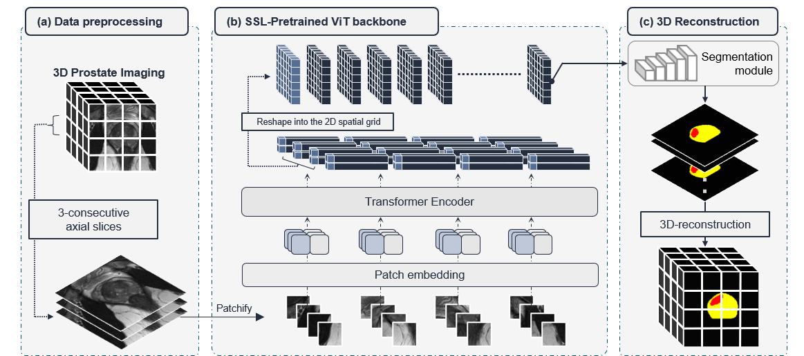
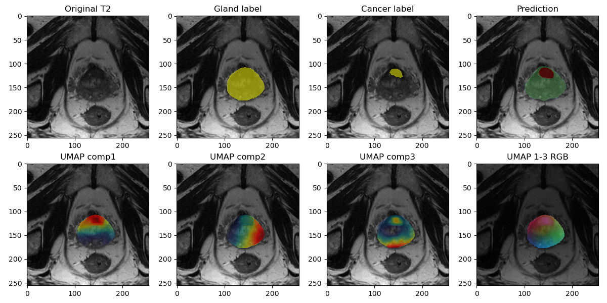

# ProViDNet: Leveraging Self-Supervised Learning for Medical Image Segmentation

The code is only for research purposes. If you have any questions regarding how to use this code, feel free to contact Dr.Mirabela Rusu (Mirabela.rusu@stanford.edu).


## Overview
ProViDNet introduces a novel approach for medical image segmentation by leveraging self-supervised learning, specifically utilizing the DINO (Distillation with No Label) v2 architecture. This model significantly improves prostate cancer segmentation accuracy across various MRI modalities and 3D Transrectal Ultrasound (TRUS) datasets.


## Architecture
</img>


## Implementation
We developed the suggested architecture using the PyTorch framework (version 2.1.0+cu114) on a NVIDIA RTX A6000 GPU with 48 GB of memory.

### Setup
To set up the project environment:

```bash
git clone https://github.com/pimed/providnet.git
cd providnet
pip install -r requirements.txt
```

## Data preparation & configuration
Your dataset should be organized into directories as specified in `config.yaml`.
The script expects MRI and TRUS images along with their corresponding labels.

```yaml
Modality: 'TRUS' # or T2, ADC, DWI
paths:
  Image_path: '/path/TRUS/' # ex: patientID_caseID_trus.nii.gz
  Gland_path: '/path/TRUS_Prostate_Label/' # ex: patientID_caseID_trus_prostate_label.nii.gz
  Label_path: '/path/TRUS_ROI_Bxconfirmed_Label/' # ex: patientID_caseID_trus_roi_bxconfirmed_label.nii.gz

SplitValidation:
    internal_split: '/path/data_split/splits_final.json'
    # [{"train": ["patientID_CaseID-1", "patientID_CaseID-2", ...],
    #   "val": ["patientID_CaseID-1", "patientID_CaseID-1", ...]}]

    testset: '/home/sosal/Data/data_split/Stanford_multimodal_bx_test_data.json'
    #  {"bx_test":[
    #    {"Anon_ID": "patient_ID_CaseID". ...},
    #    {"Anon_ID": "patient_ID_CaseID". ...}
    #  ]}
```

```
-/input
  -/images
    -- patientID_caseID_trus.nii.gz
       ....
  -/gland
    -- patientID_caseID_trus_prostate_label.nii.gz
       ....
  -/cancer
    -- patientID_caseID_trus_roi_bxconfirmed_label.nii.gz
       ....
``` 

## Training
### Usage: train.py

```bash
python train.py \
    --ModelName ProViDNet \           # select encoder architecture
    --vit_backbone dinov2_s_reg \     # ViT backbone size
    --img_size 448 \                  # input image size
    --learning_rate 0.001 \           # decoder learning rate
    --DINO_learning_rate 0.00001 \    # encoder learning rate of DINO ViT
    --epoch 30 \                      # training epoch
    --filter_background_prob 0.5 \    # random filter out of prostate gland
```

### Load model
```python
from ModelArchitectures.Models import GetModel
MODEL = GetModel(ModelName='ProViDNet', nClass=3, nChannel=3, img_size=448, vit_backbone='dinov2_s_reg')
```

### Command Line Arguments Explanation

Below are the options and arguments you can use with our command-line interface:
#### Model Configurations
- `--ModelName`: Choose the segmentation model architecture. Examples include ProViDNet, UCTransNet, etc. For more options, refer to 'ModelArchitectures/Models.py'.
- `--vit_backbone`: Specify the DINO ViT backbone, applied only for ProViDNet. Options include: [dinov2_s_reg, dinov2_b_reg, dinov2_l_reg, dinov2_g_reg].
- `--cuda_device`: Specify CUDA visible devices.
- `--img_size`: Set the image size. For ProViDNet & ProViNet use 448, for UCTransNet, MISSFormer, etc., use 256.
- `--nClass`: Define the number of classes. Typically includes Background, Gland, Cancer.
- `--nChannel`: Set the number of channels, corresponding to the number of consecutive slices. The default is 3.

#### Training Configurations
- `--Bag_batch_size`: Indicates the number of images included in mixing slices for training.
- `--num_workers`: Set the number of workers for DataLoader. Helps in parallel data loading.
- `--small_batchsize`: The actual batch size used in training as an input to the model.
- `--learning_rate`: Set the learning rate for model training.
- `--DINO_learning_rate`: Set the learning rate specifically for the DINO backbone.
- `--epoch`: Specify the number of epochs for training.
- `--train_class_weight`: Set the class weights for training, usually to handle class imbalance.
- `--valid_class_weight`: Set the class weights for validation.
- `--filter_background_prob`: Set the probability threshold to filter out background regions (excluding gland and cancer areas) during training..
- `--pretrained_weights`: Path to the pretrained weights, if you are starting from an existing model.
- `--save_directory`: Directory where the trained model weights will be saved.
- `--cuda_device`: Specify CUDA visible devices.
Remember to replace placeholders (e.g., `CUDA_DEVICE`, `MODELNAME`) with your actual configuration values.


#### Other Encoder architectures
 - MISSFormer [[paper](https://arxiv.org/abs/2109.07162)]
 - SwinUNet [[paper](https://link.springer.com/chapter/10.1007/978-3-031-25066-8_9)]
 - TransUNet [[paper](https://arxiv.org/abs/2102.04306)]
 - UCTransNet [[paper](https://ojs.aaai.org/index.php/AAAI/article/view/20144)]
 - UNet [[paper](https://link.springer.com/chapter/10.1007/978-3-319-24574-4_28)]
 - NestedUNet [[paper](https://arxiv.org/abs/1807.10165)]

```python
from ModelArchitectures.Models import GetModel
MODEL = GetModel(ModelName='UCTransNet', nClass=3, nChannel=3, img_size=256, vit_backbone='dinov2_s_reg')
```


## For model evaluation:
To train the model, adjust your configurations in `config.yaml`, then run:

### Usage: evaluate.py
python evaluate.py --pretrained_weights <path_to_trained_model> --save_pred 1 --save_heatmap 1

#### run Evaluation
```bash
python evaluate.py \
    --ModelName ProViDNet \
    --vit_backbone dinov2_s_reg \
    --img_size 448 \
    --small_batchsize 8 \
    --pretrained Segmentation_ADC_ProViDNet_best.pth \
    --save_heatmap \
```
#### Evaluation Configurations
- `--save_directory`: Specify the directory where lesion-level evaluation results will be saved. Defaults to `./Evaluation/`.
- `--eval_threshold`: Set the threshold for cancer detection during evaluation. The default is `0.50`.
- `--save_pred`: Add this flag to save the cancer prediction maps. This flag is not set by default.
- `--save_pred_directory`: If `--save_pred` is used, this argument specifies the directory where cancer prediction maps will be saved.
- `--save_heatmap`: Include this flag to enable the saving of heatmaps. By default, heatmaps are not saved.

### Visualization of DINOv2 Feature Representations
To map these features to the scale of our target label, we applied a linear interpolation resizing operation across all embedding dimensions to match the original image shape. After resizing, we applied Uniform Manifold Approximation and Projection (UMAP) for dimensionality reduction, extracting key components for a clearer visualization of our model's learning features.

</img>


## Contributing
We welcome contributions and suggestions. Please submit pull requests or open an issue if you have feedback or proposals.

## License
Specify your project's license here.

## Citation
If you use ProViDNet in your research, please cite our paper:


@article{yourCitation,
    title={ProViDNet: Leveraging Self-Supervised Learning for Medical Image Segmentation},
    author={Authors},
    journal={Journal Name},
    year={Year}
}
